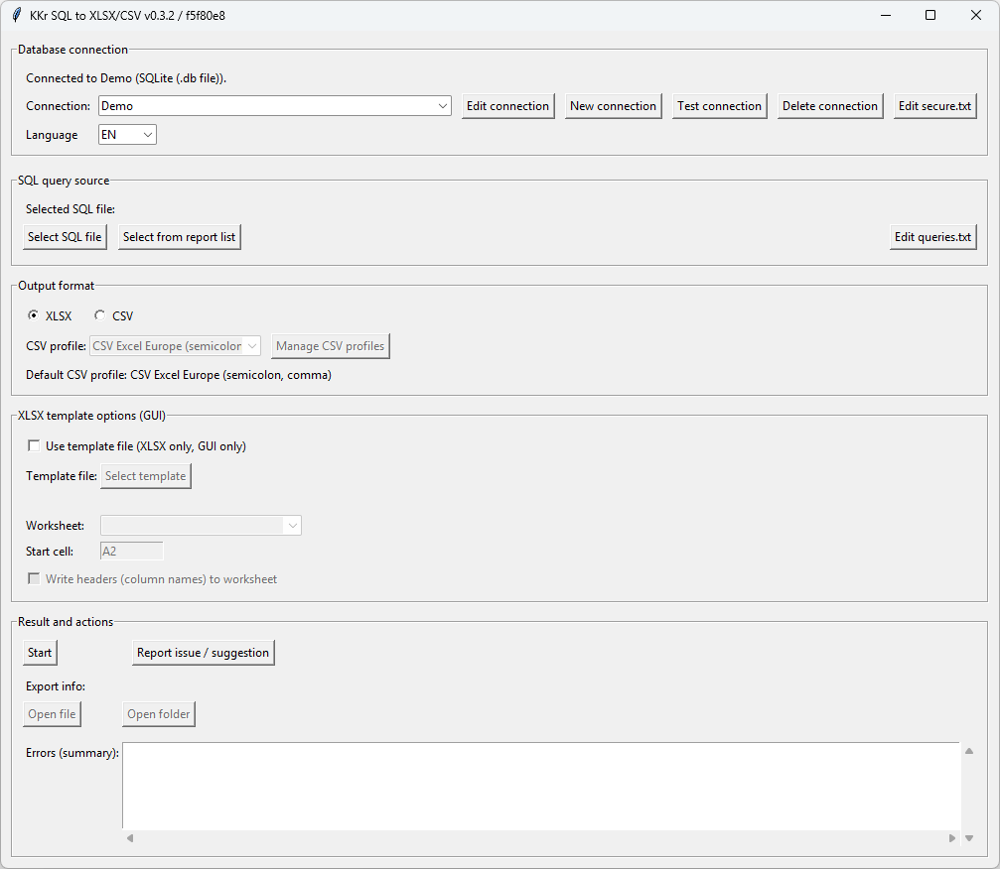

# kkr-query2xlsx

Run **SQL queries from `.sql` files** and export results to **Excel (XLSX)** or **CSV** — either with a simple **GUI (Tkinter)** or from the **CLI**.

If you ever:
- copy/pasted query results into Excel,
- ran the same report again and again,
- needed a small “run this SQL → save a spreadsheet” tool,

…this project is for you.



---

## What is it?

**kkr-query2xlsx** is a lightweight SQL runner that:
1. takes a `.sql` file,
2. runs it against a chosen database connection,
3. exports the result to **XLSX** or **CSV**,
4. writes it into a predictable output folder (`generated_reports/`).

It also includes quality-of-life features like:
- retry handling for deadlocks,
- CSV profiles (delimiter/encoding/quoting/date format, etc.),
- exporting into an existing XLSX template (GUI),
- a demo SQLite database + example queries (so you can try it immediately).

> Note on naming: the Windows executable is currently called **`kkr-query2sheet.exe`** (legacy name),
> while the repo is **kkr-query2xlsx**. Functionality is the same.

---

## When is it a good fit?

✅ Great for:
- analysts & ops who need repeatable exports,
- small internal reporting workflows,
- “one query = one spreadsheet” patterns,
- sharing SQL reports with non‑technical teammates.

🚫 Not a BI platform:
- no dashboards,
- no semantic model,
- no multi-step ETL pipelines.

---

## Choose how you want to run it

You have **two options**:

### Option 1 — Windows app (recommended for most users)
- ✅ **No Python needed**
- ✅ **No installation** (download + unzip + run)
- ✅ Auto-creates local config on first run (no manual copying)
- ✅ Best for non-developers

### Option 2 — Run from source (developers / non-Windows)
- Requires Python + dependencies
- Best if you want to modify the code, contribute, or run on Linux/macOS

---

## Option 1 — Download the Windows app (no Python)

1. Open **Releases**: https://github.com/kkrysztofczyk/kkr-query2xlsx/releases  
2. Download the latest file: `kkr-query2sheet-vX.Y.Z-windows.zip`
3. **Unzip** it (important: don’t run the exe from inside the zip)
4. Run: `kkr-query2sheet\kkr-query2sheet.exe`

That’s it — no Python installation required.

### First run = zero manual setup
On first run the app creates local files automatically (only if missing):
- `secure.sample.json` → `secure.txt` (connections)
- `queries.sample.txt` → `queries.txt` (optional list for “choose from list”)

Existing files are never overwritten.

> Note: The Windows app bundles Python libraries, but some database types still require system drivers
> (e.g. SQL Server requires an installed ODBC driver).

---

## Quickstart (Demo — try it in 60 seconds)

This repo includes:
- `examples/db/demo.sqlite` (demo database)
- `examples/queries/` (sample SQL files)

### Run a demo query (GUI)
1. Start the app
2. Select connection: **Demo SQLite**
3. Choose a query from `examples/queries`
4. Choose output format: **XLSX** or **CSV**
5. Click **Start**
6. Your file will appear in: `generated_reports/`

---

## How to use (GUI)

### Run your own query
1. Create or select a connection
2. Pick a `.sql` file (or pick from the list in `queries.txt`)
3. Choose export format (XLSX/CSV)
4. Click **Start**
5. Use **Open file** / **Open folder** buttons after export

### Export into an existing Excel template (GUI only)
If enabled, the app:
- copies your template to the output file
- pastes data into the chosen sheet starting at a cell (e.g. `A2`)
- optionally writes headers

---

## Where are my files?

- Exports: `generated_reports/`
- Logs: `logs/kkr_query2sheet.log` (rotating)

---

## Supported databases

- SQLite
- SQL Server (ODBC)
- PostgreSQL
- MySQL

Driver notes (when running from source):
- SQL Server: `pyodbc` + installed ODBC driver (e.g. Microsoft ODBC Driver 17/18 for SQL Server)
- PostgreSQL: `psycopg2` or `psycopg`
- MySQL: `pymysql`

---

## Configuration files (created automatically)

### `secure.txt` (connections)
Local JSON file with connection settings (may include credentials). **Never commit it.**

### `queries.txt` (optional “choose from list”)
Optional text file listing paths to `.sql` files (one per line).

### `kkr-query2xlsx.json` (CSV profiles)
CSV profiles (delimiter, encoding, decimals, quoting, date format, etc.).

Important:
- `delimiter_replacement` replaces delimiter characters in **all** string fields (global replacement).
  Use only if your import system cannot handle escaping.

---

## Recommended repo/workspace layout (examples vs private files)

Public examples (safe to commit):
- `examples/db/` — demo SQLite database
- `examples/queries/` — sample SQL files
- `examples/templates/` — optional sample XLSX templates

Your private workspace (keep local, not in public git):
- `queries/` — your `.sql` files
- `templates/` — your XLSX templates
- `data/` or `db/` — your databases

---

## Option 2 — Run from source (developers)

Install dependencies:

```bash
python -m pip install -r requirements.txt
```

Run GUI:

```bash
python main.pyw
```

Run CLI:

```bash
python main.pyw -c
```

Language (GUI/CLI):

```bash
python main.pyw --lang en
python main.pyw --lang pl
```

---

## Troubleshooting (Windows)

- **Always unzip first** (don’t run the exe inside the zip)
- If Windows blocks the download: right-click the `.zip` → Properties → **Unblock**
- If antivirus/EDR blocks the app, whitelist the extracted folder (common with packed apps)

---

## Security

- `secure.txt` may contain credentials — never commit it.
- Logs may contain SQL fragments and driver errors — treat logs as sensitive.
- This tool executes arbitrary SQL — run only queries you trust.

---

## Maintainers (build & release)

Build/release instructions for the Windows EXE are documented in: `docs/BUILD_WINDOWS.md`

---

## License

MIT
